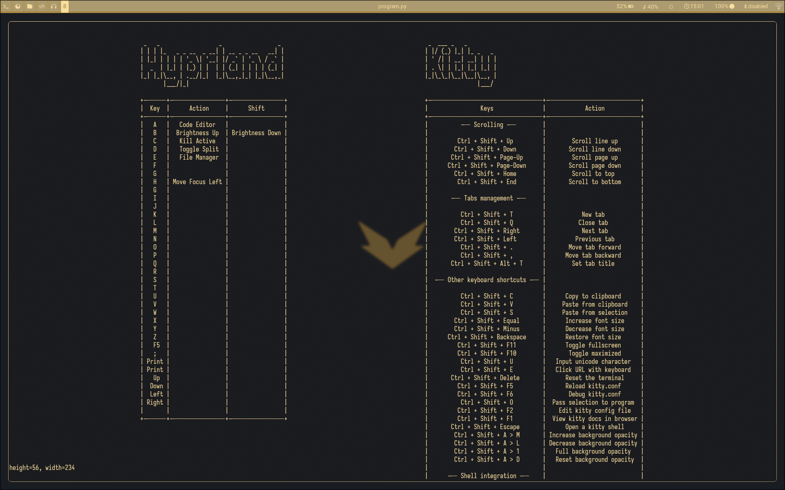

A mini project to help me remember various keybinds in my Hyprland Setup.

## How the program works -
It uses the special additional window provided by most modern terminal emulators, call 'Alternate Screen Buffer'. If you have ever used Vim, NeoVim or opened a man page, You know what I am talking about. The 'Second screen' which magically appears for our purpose and escapes out when the purpose is finished. The text which was present before, reappears again afterwards.
I have used a new keybind to open a kitty window and execute the program inside it. This Way I only have to remember this One single Keybind.

### Screenshot of running script -

## Present Structure -
- The Script works as it is expected to.
- If the window width is sufficient, then tables arrange themselves side-by-side.
- If not, then they appear one below another.
## Future Improvements for Phase 2 -
- If the window size is even smaller than first window, the script will throw error. Logic is not built that far and flexible yet.
- More shortcuts can be added, currently only kitty and hyprland keybinds are listed.
- The script can be divided among different or at least one more module. This module can store our extra functions, shortcut variables, lists, headings, etc.
- The other module can store all these things in form of a Class. OOP concepts can improve the technical simplicity of project quite a bit.

## My Learning from this project -
- I learned to use the 'Alternate screen buffer' through a Python Module.
- How can I use a script requiring packages in a virtual environment without even activating the virtual environment.
- Helped in brushing up some concepts of object placements and navigation first encountered in game development using Pygame Module.
- Strengthen the concepts on low level coding and data structures the terminal emulator software use.
- Helped in Understanding the need on Object Oriented Programming.

## Note If someone is using the script -
- Make sure to Install the requirements mentioned in requirements.txt after initializing you Venv.
- The paths in my scripts are absolute and use '/' as I use a GNU/Linux based Distribution. You should probably change them if you are on windows.
- The way I have used utilized packages without using an active virtual environment at all times, is possible because this python script has been given executable permission.
